# WildTree App (Workshop Ordering Tool)

Hosted version here: [WildTree App](http://dayne.me/WildtreeApp)

This is an application that helps [WildTree](http://www.wildtree.com) reps communicate and purchase meat bundles from butchers for freezer meal workshops.  It solves the current problem of reps communicating with butchers by email for preparing customer bundle orders.

## Technologies

Angular | FireBase | SASS | Bower | Grunt

## Video Overview

You can watch a quick 7 minute video presentation of the application [here](https://youtu.be/yrpp7L15fvk).

## Table of Contents

- [Login](#Login)
- [Rep Account](#rep-account)
  - [Creating Workshops](#creating-workshops)
  - [Adding Orders](#adding-orders)
    - [Normal Order](#adding-normal-order)
    - [Custom Order](#adding-custom-order)
  - [Order Dashboard](#order-dashboard)
  - [Messaging](#messaging)
- [Butcher Account](#butcher-account)
  - [Dashboard](#dashboard)
    - [View Workshop](#view-workshop)
    - [Approve Workshop](#approve-workshop)
    - [Print Workshop](#print-workshop)
  - [Messaging](#messaging)

## Walkthrough

Below is a Walkthrough of the functionality of the application from a rep and butcher user role.

### Login

The application has user authentication through Firebase.  You are able to login with a Google or Facebook account.  _(Currently all accounts created are rep accounts.)_

<kbd>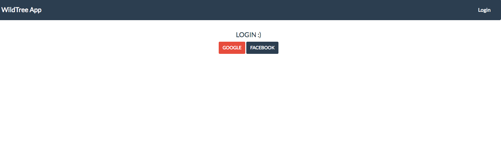</kbd>

## Rep Account

### Creating Workshops

The first time a user logins as a rep they will see a an empty list of workshops with the option to create one.

<kbd>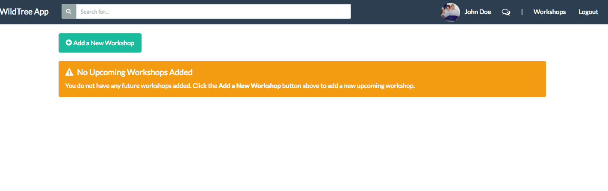</kbd>

Once a user clicks _"Add a New Workshop"_ a modal will open with options for name, date, time and bundles.

<kbd>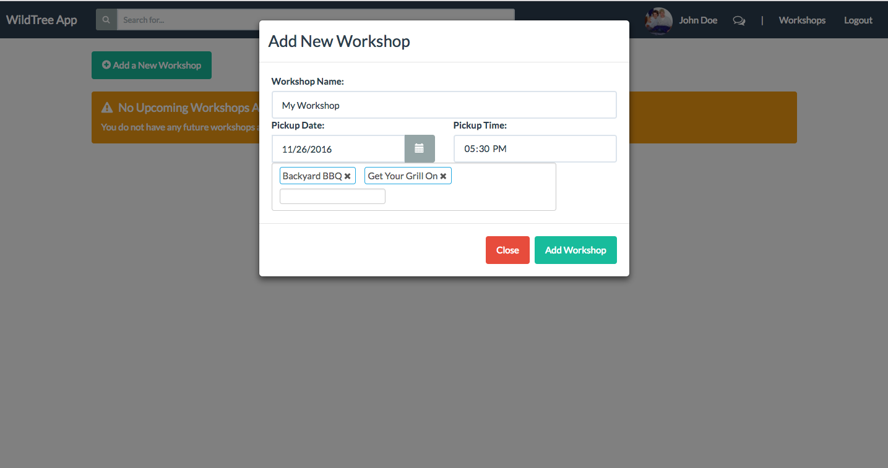</kbd>

Once the user clicks _"Add Workshop"_ then the modal is closed and the new workshop is added to the dashboard with options to submit the workshop, add orders or delete the workshop.

<kbd>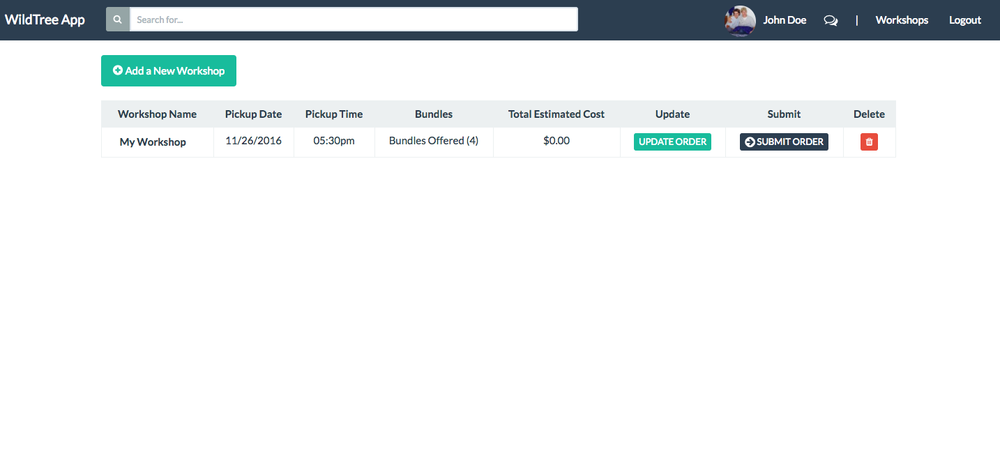</kbd>

### Adding Orders

Clicking on _"Update Order"_ will open the order dashboard for the new workshop as seen below.  Since it is the first time it has been selected for this workshop the order will be empty.

<kbd>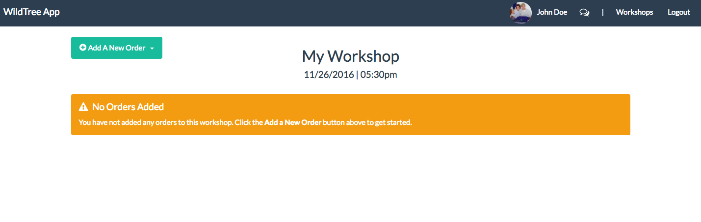</kbd>

Clicking on _"Add A New Order"_ will the user the option to _"Add Order"_ or  _Add Custom Order"_ _(A custom order will let the user change the default meat on each meal)_.

<kbd>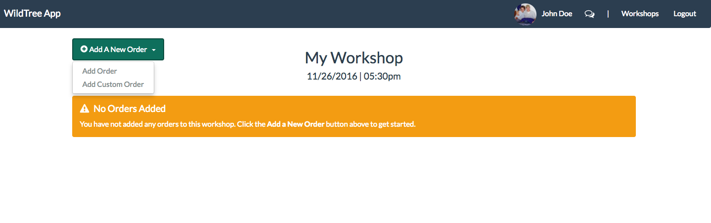</kbd>

#### Adding Normal Order

The user selects the bundle type and will be shown a list off the meals included.  They can then add the quantity needed and click _"Add Order"_.

<kbd>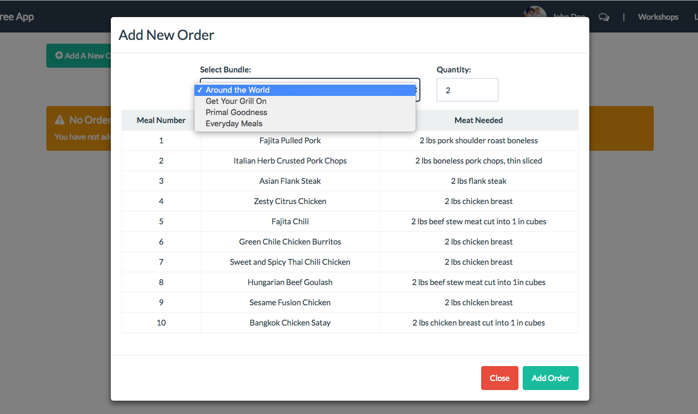</kbd>

#### Adding Custom Order

The user can select the bundle they need to make custom.  They can then select the meats they need to update in each meal.  After that they add the quantity and click _"Add Order"_.

<kbd>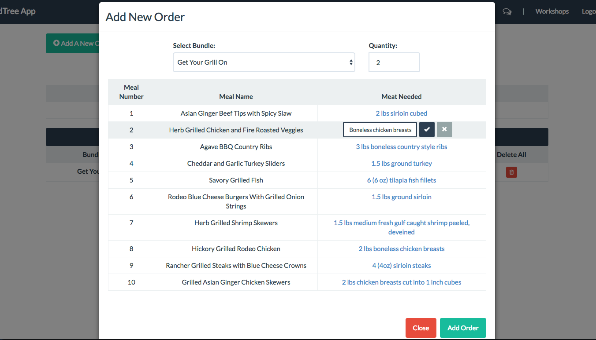</kbd>

### Order Dashboard

Once orders are added the order dashboard will look like the screen below with the option to remove and update orders.

<kbd>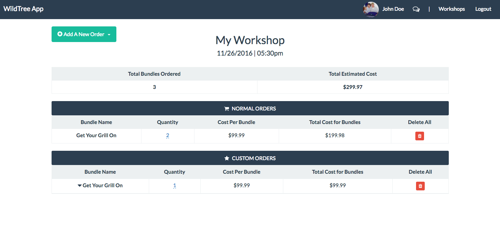</kbd>

### Messaging

Once a user clicks the chat bubble icons on the nav bar they will be taken to the messaging screen which will look similar to the one below.

The messaging system uses websockets allowing for real time updates (without refresh) of messages and notifications.

<kbd>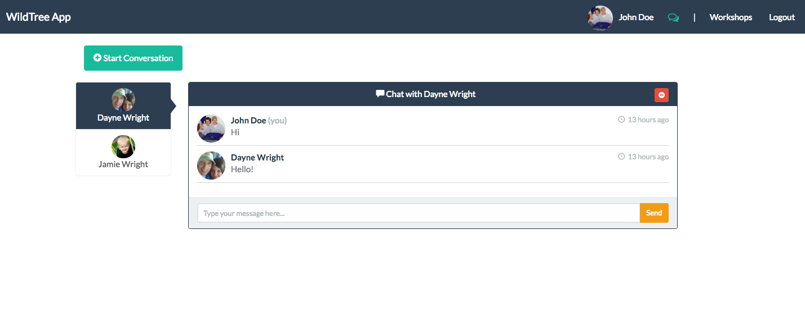</kbd>

The user can then click on a specific conversation, delete a conversation or click _"Start Conversation"_ to add a new conversation with any user that has not already been started.  Also, any delete or create action you perform on your end will impact the user you are messaging by deleting or adding messing in their account.

<kbd>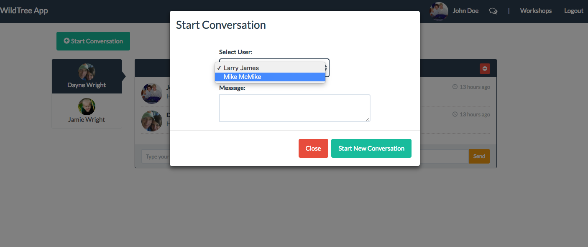</kbd>

## Butcher Account

When a butcher logs in they will see a dashboard containing workshops submitted from reps listed in the order of most recent workshop date.

<kbd>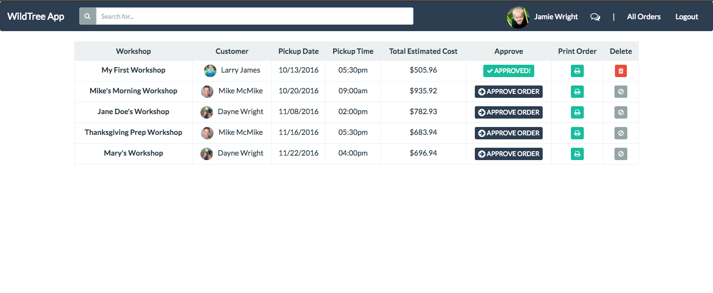</kbd>

### View Workshop

When a butcher clicks the _"Print Order"_ button on a workshop, they are shown a modal with all the workshop details like below.

<kbd>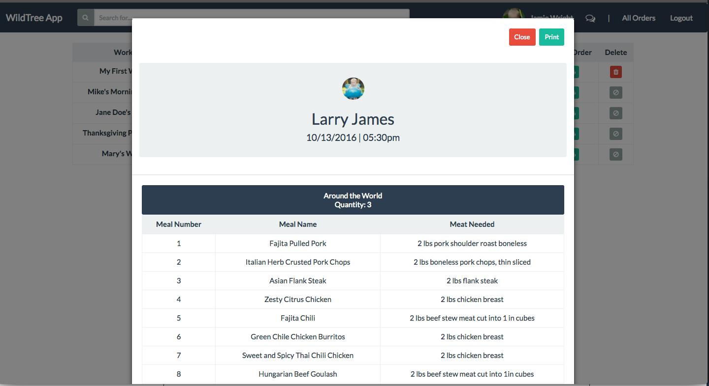</kbd>

### Approve Workshop

The butcher is able to click _"Approve Workshop"_ on any listed workshops.  This will update the status of the workshop on the rep side allowing them to see that the butcher has approved the current order.

### Print Workshop

Once a butcher has opened the print modal then they will see a print button in the top right.  This will prompt the printer with a simple list formatting of the order that are on this workshop for fulfillment.

<kbd>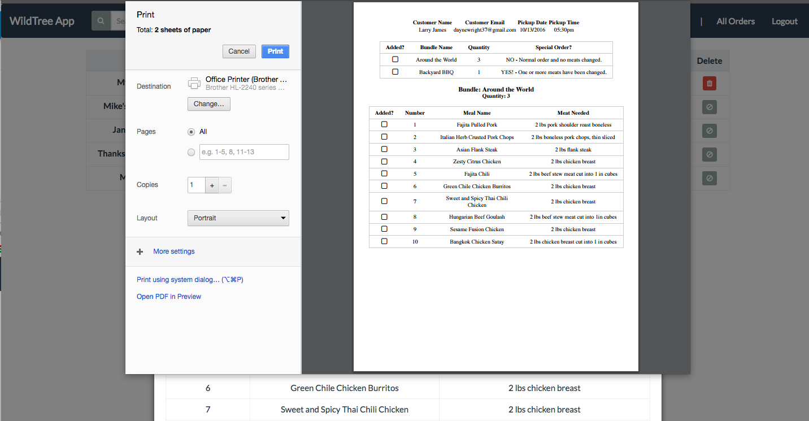</kbd>
