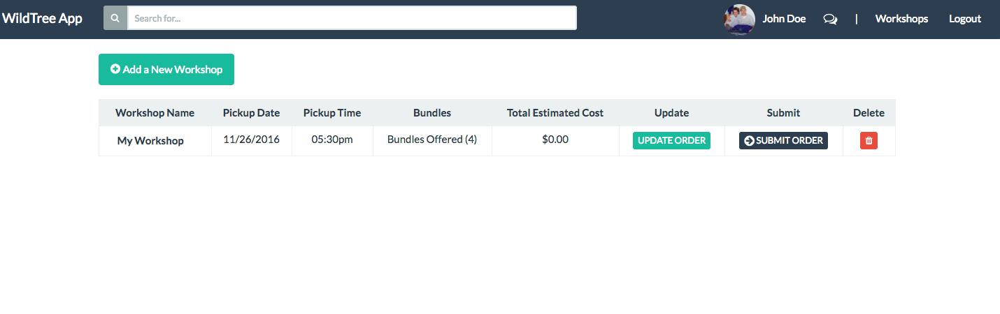

# WildTree App (Workshop Ordering Tool)

Hosted version here: [WildTree App](#)

This is an application that helps [WildTree](http://www.wildtree.com) reps communicate and purchase meat bundles from butchers for freezer meal workshops.  It solves the current problem of reps communicating with butchers by email for preparing customer bundle orders.

## Technologies

Angular | FireBase | SASS | Bower | Grunt

## Video Overview

You can watch a quick 7 minute video presentation of the application [here](#).

## Walkthrough

Below is a Walkthrough of the functionality of the application from a rep and butcher user role.

### Login

The application has user authentication through Firebase.  You are able to login with a Google or Facebook account.  _(Currently all accounts created are rep accounts.)_

## Rep Account - User Experience

### Creating Workshops

The first time you login as a rep you will see a an empty list of workshops with the option to create one.

Once you click "Add a New Workshop" a modal will open with options for name, date, time and bundle options.

Once you click "Add Workshop" then the modal is closed and the new workshop is added to the dashboard with options to submit, add orders or delete.

### Board View

After you add a board you can then create pins for that board.  You need an image link, title and description.  The top four pins are used for the main images on the board view.

### Adding & Deleting Pins

Once pins are made you can drag and drop to sort and click edit to change any details on that specific pin.

